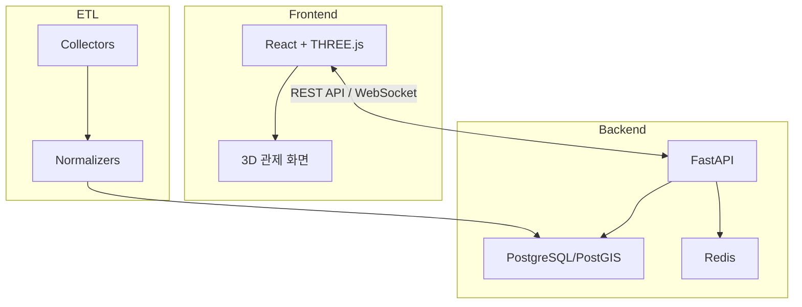

# About

## 프로젝트 개요

**울산항 3D 관제 시스템**은 울산항의 실시간 운영 현황을 3D 웹 대시보드로 시각화하는 모니터링 플랫폼입니다.

공공데이터 기반의 선박, 접안시설, 기상, 화물 통계, 온톨로지 관계 탐색을 하나의 통합 대시보드로 제공합니다.

> 2026 스마트해운물류 x ICT 멘토링 프로젝트

## 기술 스택

### Frontend

| 기술 | 용도 |
|------|------|
| React + TypeScript | UI 프레임워크 |
| THREE.js / @react-three/fiber | 3D 렌더링 |
| Vite | 빌드 도구 |
| Tailwind CSS | 스타일링 |
| Zustand | 상태 관리 |

### Backend

| 기술 | 용도 |
|------|------|
| FastAPI | REST API 서버 |
| PostgreSQL + PostGIS | 공간 데이터베이스 |
| Redis | 이벤트 분배 / Pub-Sub |
| SQLAlchemy 2.0 | ORM |
| Alembic | DB 마이그레이션 |

### ETL / Data

| 기술 | 용도 |
|------|------|
| Python 3.11 | ETL 파이프라인 |
| APScheduler | 수집 스케줄링 |
| Pydantic v2 | 데이터 검증 |

## 시스템 구성

## 주요 기능

- **3D 항만 시각화** — 울산항의 접안시설, 선박, 부표를 3D로 렌더링
- **실시간 선박 모니터링** — 선박 위치, 상태, 입출항 정보 실시간 표시
- **접안시설 관리** — 접안시설별 상태 및 운영 현황 모니터링
- **기상/조위 정보** — 실시간 기상 및 조위 데이터 연동
- **화물 통계** — 화물 종류별 통계 대시보드
- **온톨로지 탐색** — 항만 도메인 엔티티 간 관계 그래프 탐색

## 리포지토리

- **소스 코드**: [github.com/yeongseon/ulsan-port-3d](https://github.com/yeongseon/ulsan-port-3d)
- **라이선스**: MIT License
