# 울산항 3D 관제 시스템 — 시스템 아키텍처

> **2026 스마트해운물류 × ICT 멘토링** 공모전 제출용 기술 문서
>
> 프로젝트: `ulsan-port-3d` | 팀: [팀명 기입] | 작성일: 2026-04-24

---

## 1. 프로젝트 개요

울산항 공공데이터(선박 위치, 선석 현황, 기상, 화물 통계 등)를 실시간으로 수집·정규화하고,
**온톨로지 기반 지식 그래프**와 **3D WebGL 관제 화면**으로 시각화하는 풀스택 웹 애플리케이션이다.

### 핵심 차별점

| 항목 | 설명 |
|------|------|
| **온톨로지 우선 설계** | 모든 도메인 엔티티(항구, 구역, 선석, 선박, 항차 등)를 OWL 스타일 클래스/관계로 먼저 정의하고, DB 스키마와 API가 이를 반영 |
| **3D 실감 관제** | THREE.js + React Three Fiber로 울산만 실제 지형(해안선, 방파제, 태화강)과 선박을 프로시저럴 렌더링 |
| **실시간 스트리밍** | WebSocket + Redis Pub/Sub로 선박 위치·알림을 밀리초 단위 전파 |
| **AI 시나리오 분석** | 혼잡도·기상·화물 데이터 결합 → 규칙 엔진 + LLM 요약 → 상황별 시나리오 프레임 생성 |

---

## 2. 기술 스택

### 프론트엔드 (apps/frontend)

| 기술 | 버전 | 용도 |
|------|------|------|
| React | 19 | UI 프레임워크 |
| TypeScript | 5.x | 타입 안전성 |
| THREE.js | 0.171 | 3D 렌더링 엔진 |
| @react-three/fiber | 9 | React 선언적 3D |
| @react-three/drei | 10 | 3D 유틸리티 (카메라, 환경맵 등) |
| Zustand | 5 | 상태 관리 (3개 스토어) |
| Tailwind CSS | 4 | 유틸리티 CSS |
| Vite | 6.4 | 번들러 + HMR |

### 백엔드 (apps/backend)

| 기술 | 용도 |
|------|------|
| FastAPI | REST API + WebSocket |
| SQLAlchemy 2.0 | ORM (async) |
| PostgreSQL + PostGIS | 공간 데이터 저장 |
| Alembic | DB 마이그레이션 |
| Redis | Pub/Sub 실시간 메시지 브로커 |
| Pydantic v2 | 요청/응답 검증 |

### ETL 파이프라인 (etl/)

| 기술 | 용도 |
|------|------|
| httpx | 비동기 HTTP 클라이언트 |
| APScheduler | 주기적 수집 스케줄링 |
| 자체 normalizer | 원본 API → 정규화 레코드 변환 |

### 공유 패키지 (packages/)

| 패키지 | 용도 |
|--------|------|
| `@ulsan-port/ontology` | 온톨로지 클래스·관계 정의 (source of truth) |
| `@ulsan-port/shared-types` | 프론트-백엔드 공유 TypeScript 타입 |
| `@ulsan-port/ui` | 공통 UI 컴포넌트 |

### 인프라

| 기술 | 용도 |
|------|------|
| Docker Compose | 로컬 개발 환경 (DB, Redis, Backend) |
| GitHub Actions | CI (빌드·린트·테스트) + CD (GitHub Pages 배포) |
| GitHub Pages | 프론트엔드 데모 호스팅 |

### 2.6 기술 스택 구성 비중

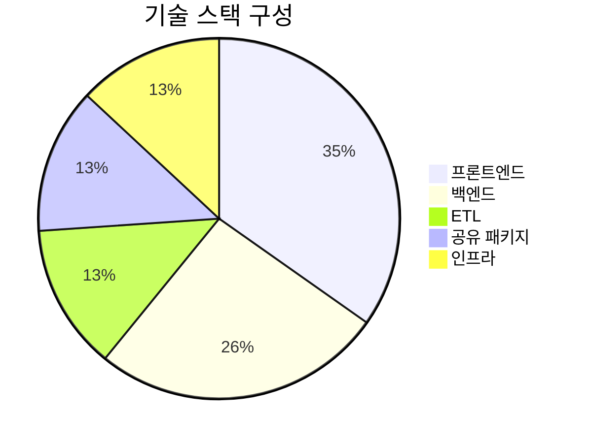

---

## 3. 시스템 아키텍처 다이어그램

```mermaid
flowchart TB
    subgraph External ["외부 공공 API"]
        API["울산항만공사 OPEN API\n(선박위치, 선석현황, 기상, 화물통계 등)"]
    end

    External -- "HTTP (fetch_with_retry, 3회 재시도, 지수 백오프)" --> ETL

    subgraph ETL ["ETL 파이프라인 (etl/)"]
        direction TB
        Collectors["Collectors\n(8개 수집기)"]
        Raw["Raw Storage\n(data/raw/)"]
        Normalizers["Normalizers\n(vessel, berth, weather, common)"]
        Upsert["DB Upsert (async)\nINSERT ON CONFLICT"]

        Collectors --> Raw
        Collectors --> Normalizers
        Raw -.-> Normalizers
        Normalizers --> Upsert
    end

    ETL -- "SQLAlchemy Async" --> DB

    subgraph DB ["PostgreSQL + PostGIS 데이터베이스"]
        direction LR
        Static["정적 테이블\n- port_zone\n- berth\n- operator\n- route_segment\n- tank_terminal\n- cargo_type"]
        TimeSeries["시계열 테이블\n- vessel_position (히스토리)\n- latest_vessel_position (최신)\n- vessel_event\n- berth_status / latest_berth_status\n- weather_observation\n- arrival_stat / cargo_stat_monthly"]
    end

    DB --> Backend

    subgraph Backend ["백엔드 API (FastAPI)"]
        direction TB
        Router["HTTP 라우터\n(/vessels, /berths, /weather, /stats, ...)\nWebSocket 라우터\n(/ws/live, /ws/events)"]
        Service["서비스 레이어\n(vessels, berths, weather, stats, graph, ...)\n(alert_engine, rule_engine, scenario_generator, ...)"]
        Router <--> Service
    end

    Backend -- "HTTP + WebSocket" --> Frontend

    subgraph Frontend ["프론트엔드 (React + THREE.js)"]
        direction TB
        subgraph Stores ["Zustand 스토어"]
            dataStore["dataStore\n(도메인)"]
            mapStore["mapStore\n(3D 씬)"]
            uiStore["uiStore\n(UI 상태)"]
        end

        subgraph Canvas ["PortScene (Canvas)"]
            StaticScene["StaticScene (memo)\n· SeaPlane\n· LandMass (지형)\n· PortGeometry"]
            DynamicLayers["DynamicLayers\n· VesselLayer (선박)\n· BerthStatusLayer (선석)\n· RouteLayer (항로)"]
        end

        UI["UI 패널\n(선박상세, 선석상세, 기상, 통계, 온톨로지그래프, 알림배너, 필터, 헤더)"]

        Stores --> Canvas
        Canvas --> UI
    end
```

---

## 4. 모노레포 구조

```
ulsan-port-3d/
├── apps/
│   ├── frontend/                    # React + THREE.js 프론트엔드
│   │   ├── src/
│   │   │   ├── components/
│   │   │   │   ├── scene/           # 3D 씬 컴포넌트 (7개)
│   │   │   │   │   ├── PortScene.tsx       # 메인 Canvas, 정적/동적 레이어 분리
│   │   │   │   │   ├── LandMass.tsx        # 울산만 실제 해안선·방파제·태화강
│   │   │   │   │   ├── PortGeometry.tsx    # 부두 구조물·크레인·저유탱크
│   │   │   │   │   ├── VesselLayer.tsx     # 프로시저럴 선박 모델 (5종)
│   │   │   │   │   ├── BerthStatusLayer.tsx# 선석 상태 오버레이
│   │   │   │   │   ├── RouteLayer.tsx      # 항로 라인 렌더링
│   │   │   │   │   ├── SeaPlane.tsx        # 해수면 평면
│   │   │   │   │   └── portLayout.ts       # 부두 배치 데이터 (12개 부두)
│   │   │   │   ├── panels/          # UI 패널 (7개)
│   │   │   │   │   ├── VesselDetailPanel.tsx
│   │   │   │   │   ├── BerthDetailPanel.tsx
│   │   │   │   │   ├── WeatherPanel.tsx
│   │   │   │   │   ├── StatsPanel.tsx
│   │   │   │   │   ├── OntologyGraphPanel.tsx
│   │   │   │   │   ├── AlertBanner.tsx
│   │   │   │   │   └── FilterPanel.tsx
│   │   │   │   └── layout/          # 레이아웃
│   │   │   │       ├── MainLayout.tsx
│   │   │   │       └── Header.tsx
│   │   │   ├── stores/              # Zustand 상태 관리 (3개)
│   │   │   │   ├── dataStore.ts     # 도메인 데이터 (선박, 선석, 기상)
│   │   │   │   ├── mapStore.ts      # 3D 씬 상태 (카메라, 레이어, 선택)
│   │   │   │   └── uiStore.ts       # UI 상태 (패널 토글, 타임라인)
│   │   │   ├── api/
│   │   │   │   └── client.ts        # HTTP API 클라이언트
│   │   │   ├── mock/                # 데모 모드 Mock 시스템
│   │   │   │   ├── data.ts          # Mock 데이터 (선박 15척, 선석 12개)
│   │   │   │   ├── mockClient.ts    # Mock API 클라이언트
│   │   │   │   ├── mockWebSocket.ts # Mock WebSocket 시뮬레이터
│   │   │   │   └── index.ts         # enableMocks() 진입점
│   │   │   ├── hooks/
│   │   │   │   └── useWebSocket.ts  # WebSocket 연결·재연결 훅
│   │   │   ├── utils/
│   │   │   │   └── coordinates.ts   # WGS84 ↔ 3D 로컬 좌표 변환
│   │   │   ├── App.tsx              # 앱 루트 (Mock/실환경 분기)
│   │   │   └── main.tsx             # 엔트리포인트
│   │   └── (설정 파일: vite, tailwind, tsconfig, eslint, postcss)
│   │
│   └── backend/                     # FastAPI 백엔드
│       ├── app/
│       │   ├── main.py              # FastAPI 앱 생성·미들웨어·라우터 등록
│       │   ├── core/
│       │   │   ├── config.py        # 환경 변수 설정
│       │   │   ├── database.py      # SQLAlchemy async 세션
│       │   │   └── errors.py        # RFC 7807 Problem Detail 에러 핸들러
│       │   ├── models/              # SQLAlchemy ORM 모델
│       │   │   ├── static.py        # 정적 테이블 (Zone, Berth, Operator...)
│       │   │   ├── timeseries.py    # 시계열 테이블 (Position, Event, Weather...)
│       │   │   ├── documents.py     # 문서 테이블 (HazardDoc, MSDS...)
│       │   │   └── base.py          # 베이스 모델
│       │   ├── routers/             # API 라우터 (12개)
│       │   │   ├── vessels.py       # /vessels, /vessels/live
│       │   │   ├── berths.py        # /berths
│       │   │   ├── weather.py       # /weather/current
│       │   │   ├── stats.py         # /stats
│       │   │   ├── graph.py         # /graph/{type}/{id} (온톨로지)
│       │   │   ├── scenarios.py     # /scenarios
│       │   │   ├── insights.py      # /insights (AI 인사이트)
│       │   │   ├── websocket.py     # /ws/live, /ws/events
│       │   │   └── (health, port, docs)
│       │   ├── schemas/             # Pydantic 요청/응답 스키마
│       │   └── services/            # 비즈니스 로직 (18개 서비스)
│       │       ├── graph.py         # 온톨로지 그래프 탐색 엔진
│       │       ├── scenario_generator.py  # AI 시나리오 프레임 생성
│       │       ├── alert_engine.py  # 복합 알림 엔진
│       │       ├── rule_engine.py   # 규칙 기반 추론 엔진
│       │       ├── insight_rules.py # 인사이트 규칙 정의
│       │       ├── llm_summary.py   # LLM 기반 상황 요약
│       │       ├── pubsub.py        # Redis Pub/Sub 브릿지
│       │       └── (vessels, berths, weather, stats, seed, common, docs, port)
│       └── alembic/                 # DB 마이그레이션
│
├── etl/                             # ETL 파이프라인
│   ├── collectors/                  # 8개 데이터 수집기
│   │   ├── vessel_position.py       # 선박 위치 (AIS)
│   │   ├── vessel_event.py          # 선박 이벤트 (입출항)
│   │   ├── berth_status.py          # 선석 현황
│   │   ├── berth_facility.py        # 선석 시설 정보
│   │   ├── weather.py               # 기상 관측
│   │   ├── statistics.py            # 화물·입항 통계
│   │   ├── route_gis.py             # 항로 GIS 데이터
│   │   └── tank_terminal.py         # 유류 터미널
│   ├── normalizers/                 # 정규화 모듈 (4개)
│   │   ├── vessel.py, berth.py, weather.py, common.py
│   ├── common.py                    # HTTP 클라이언트, 재시도, raw 저장
│   ├── database.py                  # ETL용 async DB 세션
│   ├── scheduler.py                 # APScheduler 기반 스케줄러
│   └── config.py                    # ETL 설정 (API 키, 주기 등)
│
├── packages/                        # 공유 패키지
│   ├── ontology/src/index.ts        # 온톨로지 클래스·관계 정의
│   ├── shared-types/src/index.ts    # 공유 TypeScript 타입 (145줄)
│   └── ui/src/index.ts              # UI 패키지 (확장 예정)
│
├── docs/                            # 문서
│   ├── prd.md                       # 제품 요구사항 정의서
│   ├── ontology.md                  # 온톨로지 명세서
│   ├── api-spec.md                  # API 스펙 문서
│   └── architecture-ko.md           # ← 본 문서
│
├── .github/workflows/
│   ├── ci.yml                       # CI: 빌드 + 린트 + 테스트
│   └── deploy-pages.yml             # CD: GitHub Pages 자동 배포
│
├── docker-compose.yml               # 로컬 개발 환경 (PostgreSQL, Redis)
├── AGENTS.md                        # 개발 규칙·컨벤션 (불변 제약조건 포함)
└── README.md                        # 프로젝트 소개
```

**프로젝트 규모**: 115개 소스 파일, 약 9,500줄

---

## 5. 데이터 파이프라인 상세

### 5.1 수집 (ETL Collectors)

8개 수집기가 울산항만공사 공공 API를 주기적으로 호출한다.

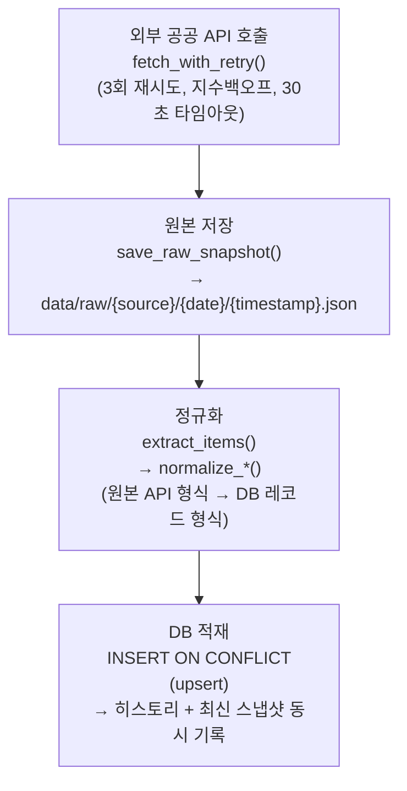

### 5.1.1 수집 흐름 시퀀스

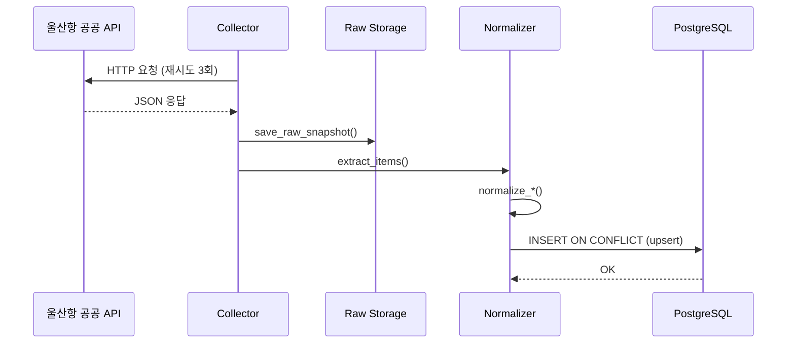

### 5.2 수집기 목록

| 수집기 | 대상 데이터 | DB 테이블 |
|--------|------------|-----------|
| vessel_position | AIS 선박 위치 | vessel_position, latest_vessel_position |
| vessel_event | 입출항 이벤트 | vessel_event |
| berth_status | 선석 가동 현황 | berth_status, latest_berth_status |
| berth_facility | 선석 시설 마스터 | berth (static) |
| weather | 기상 관측 | weather_observation |
| statistics | 입항·화물 월간 통계 | arrival_stat_monthly, cargo_stat_monthly |
| route_gis | 항로 GIS 라인 | route_segment (static) |
| tank_terminal | 유류 터미널 현황 | tank_terminal (static) |

### 5.3 정규화 규칙

- **좌표**: WGS84 (EPSG:4326)로 통일 저장 → PostGIS GEOMETRY 컬럼
- **시간**: UTC로 통일 저장, ISO-8601 형식 → 프론트에서 Asia/Seoul 변환 표시
- **식별자**: 선박 = `call_sign + arrival_year + voyage_no`, 선석 = `facility_code`

---

## 6. 온톨로지 설계

### 6.1 클래스 계층

온톨로지는 `packages/ontology/src/index.ts`에서 단일 소스로 정의된다.

| 도메인 | 클래스 | 설명 |
|--------|--------|------|
| **공간(Spatial)** | Port, Zone, Berth, Buoy, RouteSegment, Terminal, TankTerminal, Operator | 항만 물리 인프라 |
| **운항(Operational)** | Vessel, VoyageCall, VesselPosition, VesselEvent, BerthStatus, CongestionStat | 선박 운항·선석 상태 |
| **화물(Cargo)** | CargoType, LiquidCargoStat, ArrivalStat | 화물 분류·통계 |
| **환경(Environmental)** | WeatherObservation, WeatherForecast, TideObservation, HazardDoc, MsdsDoc, SafetyManual | 기상·안전 문서 |
| **UI** | Alert, Insight, ScenarioFrame | 시스템 생성 객체 |

### 6.2 관계 (Predicates)

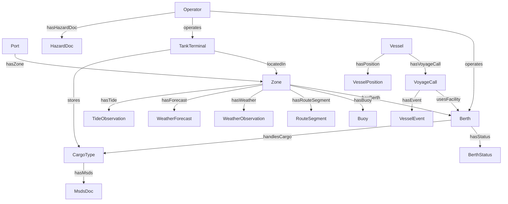

### 6.3 온톨로지 → DB 매핑

온톨로지 클래스가 DB 테이블에 1:1 또는 1:N으로 매핑된다:

- **정적 테이블** (models/static.py): PortZone, Berth, Operator, RouteSegment, TankTerminal, CargoType
- **시계열 테이블** (models/timeseries.py): VesselPosition, VesselEvent, BerthStatus, WeatherObservation
- **문서 테이블** (models/documents.py): HazardDoc, MsdsDoc, SafetyManual

### 6.4 그래프 탐색 API

`/graph/{entity_type}/{entity_id}` 엔드포인트는 온톨로지 관계를 따라 연결된 엔티티를 그래프로 반환한다.

```json
{
  "center": { "type": "Vessel", "id": "KC-2026-001", "label": "한빛호" },
  "relations": [
    { "type": "hasVoyageCall", "target": { "type": "VoyageCall", "id": "vc-123", "label": "2026-04 항차" } },
    { "type": "hasPosition", "target": { "type": "VesselPosition", "id": "pos-456", "label": "35.50°N 129.38°E" } }
  ]
}
```

---

## 7. 3D 렌더링 파이프라인

### 7.1 좌표 변환 시스템

```
WGS84 (위도/경도)  ──latLonToLocal()──▶  THREE.js 로컬 좌표

기준점: 35.500°N, 129.380°E (울산항 중심)
스케일: 1 THREE.js 단위 = 100m

축 규칙:
  X축 → 동쪽 (East)
  Y축 → 고도 (Altitude, 위로)
  Z축 → 남쪽 (South, 음수=북쪽)
```

### 7.2 씬 레이어 분리 (불변 규칙)

3D 씬은 정적 레이어와 동적 레이어로 **엄격히** 분리된다.
이는 프로젝트 불변 규칙(AGENTS.md)이며, 위반 시 차단 결함(blocking defect)으로 처리한다.

| 레이어 | 컴포넌트 | 갱신 주기 | 내용 |
|--------|----------|-----------|------|
| **StaticScene** (memo) | SeaPlane, LandMass, PortGeometry | 없음 (1회 렌더) | 해수면, 육지·해안선, 부두·크레인·탱크 |
| **DynamicLayers** | VesselLayer, BerthStatusLayer, RouteLayer | 실시간 (WS/HTTP) | 선박 위치·방향, 선석 상태 색상, 항로 |

### 7.2.1 선박 렌더링 상태도

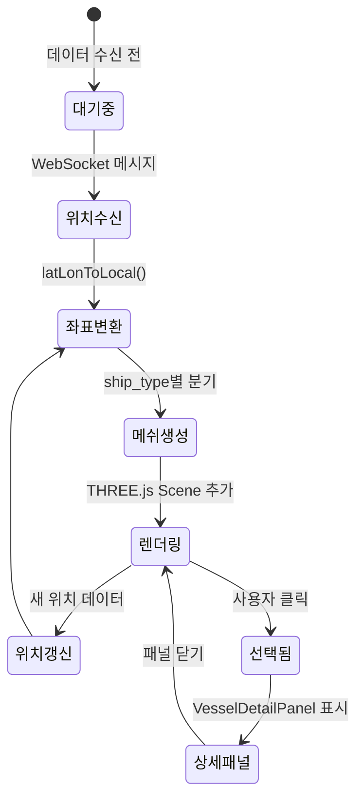

### 7.3 지형 렌더링 (LandMass)

울산만의 **실제 해안선 좌표(WGS84)**를 기반으로 다음 지형을 ExtrudeGeometry로 생성:

| 지형 요소 | 높이(Y) | 색상 | 설명 |
|-----------|---------|------|------|
| 서쪽 본토 | 0.6 | 다크 시그린 | 울산만 서안, 모든 부두 배후지 |
| 북쪽 곶 | 0.6 | 다크 시그린 | 미포항 방면, 만 입구 북측 |
| 남쪽 반도 (장생포) | 0.6 | 다크 시그린 | 만 입구 남측 |
| 항만 산업구역 | 0.65 | 블루 그레이 | 부두와 해안선 사이 |
| 북방파제 | 0.8 | 콘크리트 그레이 | 만 입구 방파제 |
| 남방파제 | 0.8 | 콘크리트 그레이 | 만 입구 방파제 |
| 태화강 | 0.62 | 연한 블루 | 본토를 가로지르는 하천 |
| 해수면 | 0.0 | 블루 | 2000×2000 평면 |

### 7.4 선박 렌더링 (VesselLayer)

선박은 `ship_type`별로 프로시저럴(절차적) 메쉬를 생성한다:

| 선종 | 길이 | 특징 |
|------|------|------|
| Container | 3.5 | 컨테이너 적재 스택 |
| Tanker | 3.2 | 원형 탱크 돔 |
| Cargo | 2.8 | 화물창 덮개 |
| Passenger | 3.0 | 객실 블록 + 창문 |
| Tug | 1.0 | 소형 예인선 |

각 선박은 다음 파츠로 구성된다:
- **선체(Hull)**: ExtrudeGeometry (선종별 공유 지오메트리, 모듈 스코프)
- **수선(Waterline)**: 흰색 띠
- **갑판(Deck)**: 평면 박스
- **브릿지(Bridge)**: 상부 박스 + 창문
- **마스트(Mast)**: 수직 기둥
- **선종별 디테일**: 컨테이너 스택 / 탱크 돔 / 크레인

**방위 변환**: AIS 방위(0°=북) → THREE.js Y축 회전(yaw = π/2 - headingRad)

### 7.5 부두 렌더링 (PortGeometry)

12개 부두가 `portLayout.ts`의 좌표·크기·회전·구역 데이터로 배치된다:

| 구역 | 부두 코드 | 색상 | 부속 구조물 |
|------|-----------|------|------------|
| 일반(general) | ULS-B01~B05 | 그레이 | 크레인 2대 |
| 벌크(bulk) | ULS-S01~S02 | 브라운 | 크레인 3대 |
| 석유(oil) | ULS-OA1, OB1 | 오렌지 | 저유탱크 3기 |
| 컨테이너(container) | ULS-KT1~KT2 | 그린 | 크레인 4대 + 컨테이너 야드 |
| 여객(passenger) | ULS-P01 | 퍼플 | 여객 터미널 건물 |

---

## 8. 상태 관리 설계

Zustand를 사용하여 3개의 독립 스토어로 분리한다.

### 8.1 스토어 경계

| 스토어 | 범위 | 주요 상태 |
|--------|------|-----------|
| **dataStore** | 도메인 데이터 | vessels[], berths[], weather |
| **mapStore** | 3D 씬 상태 | cameraPosition, activeLayerIds, selectedEntity, zoomLevel |
| **uiStore** | UI 상태 | 패널 토글, 탭, 타임라인, 재생 |

### 8.1.1 스토어 클래스 구조

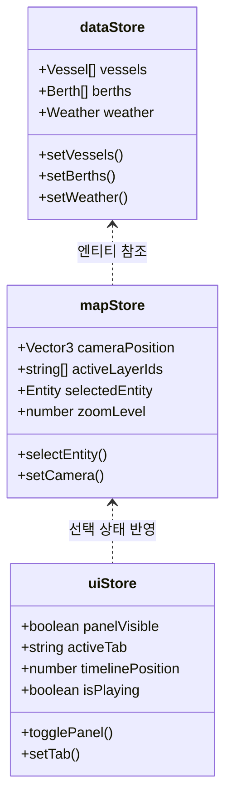

### 8.2 데이터 흐름

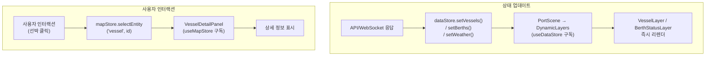

---

## 9. Mock 데모 시스템

GitHub Pages에서 백엔드 없이 동작하는 데모를 위해 Mock 시스템을 구현했다.

### 9.1 활성화 방법

```bash
VITE_USE_MOCK=true pnpm dev
```

### 9.2 동작 원리

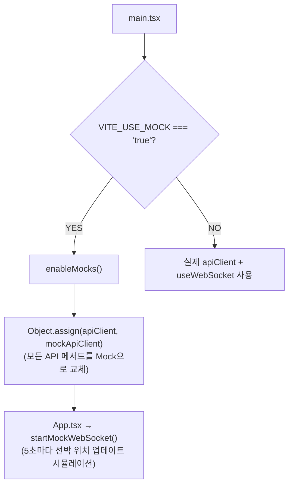

### 9.3 Mock 데이터 규모

| 데이터 | 규모 |
|--------|------|
| 선박 (vessels) | 15척 (5종 × 3척) |
| 선석 (berths) | 12개 |
| 기상 (weather) | 1건 (현재 관측) |
| 알림 (alerts) | 복수 건 |
| 온톨로지 그래프 | 노드·관계 포함 |
| 시나리오 | 복수 프레임 |

---

## 10. API 엔드포인트 요약

### HTTP 엔드포인트

| 메서드 | 경로 | 설명 |
|--------|------|------|
| GET | /health | 헬스체크 |
| GET | /port | 항만 개요 |
| GET | /vessels | 전체 선박 목록 |
| GET | /vessels/live | 실시간 선박 위치 |
| GET | /vessels/{id} | 선박 상세 |
| GET | /berths | 선석 목록 |
| GET | /weather/current | 현재 기상 |
| GET | /stats | 통계 데이터 |
| GET | /graph/{type}/{id} | 온톨로지 그래프 탐색 |
| GET | /graph/explore | 그래프 전체 탐색 |
| GET | /scenarios | 시나리오 목록 |
| GET | /scenarios/{id}/frames | 시나리오 프레임 |
| GET | /insights | AI 인사이트 |
| GET | /docs | 문서 검색 |

### WebSocket 엔드포인트

| 경로 | 설명 |
|------|------|
| /ws/live | 선박 위치 실시간 스트림 |
| /ws/events | 이벤트 (입출항, 알림) 스트림 |

---

## 11. 불변 제약조건 (INVIOLABLE)

프로젝트 전체에서 반드시 준수해야 하는 규칙:

| 규칙 | 설명 | 위반 시 |
|------|------|---------|
| **좌표 규약** | 모든 지리 데이터는 WGS84 (EPSG:4326)로 저장 | 차단 결함 |
| **시간 규약** | 모든 타임스탬프는 UTC 저장, ISO-8601 형식 | 차단 결함 |
| **3D 레이어 분리** | 정적 배경 씬과 동적 실시간 오버레이는 별도 레이어 | 차단 결함 |
| **온톨로지 우선** | 새 엔티티는 packages/ontology에 먼저 정의 | 리뷰 차단 |
| **테스트 보존** | 실패 테스트를 삭제하지 않고 근본 원인 수정 | CI 차단 |

---

## 12. 배포 파이프라인

### 12.1 브랜치 전략

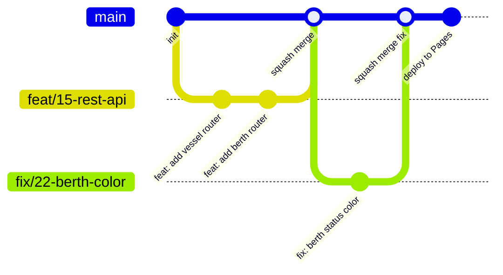

### 12.2 CI/CD 워크플로우

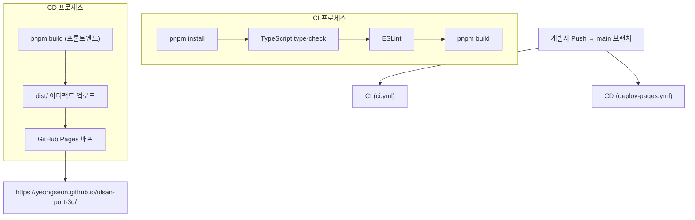

---

## 13. 시스템 컨텍스트

시스템과 외부 사용자/시스템 간의 관계를 보여준다.

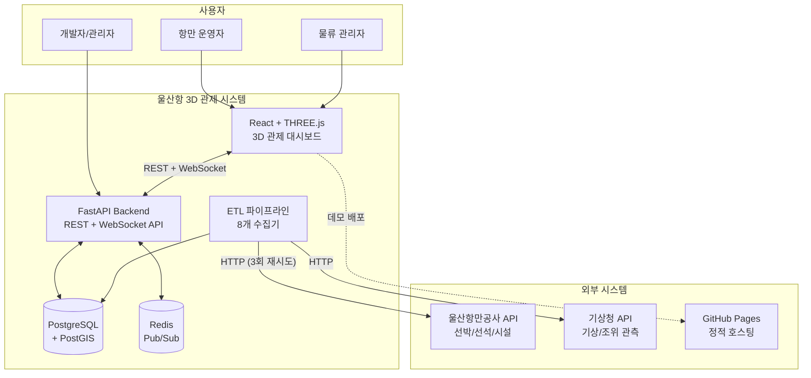

---

## 14. 운영 모드

시스템은 두 가지 실행 모드를 지원한다.

### 14.1 Full-Stack 모드

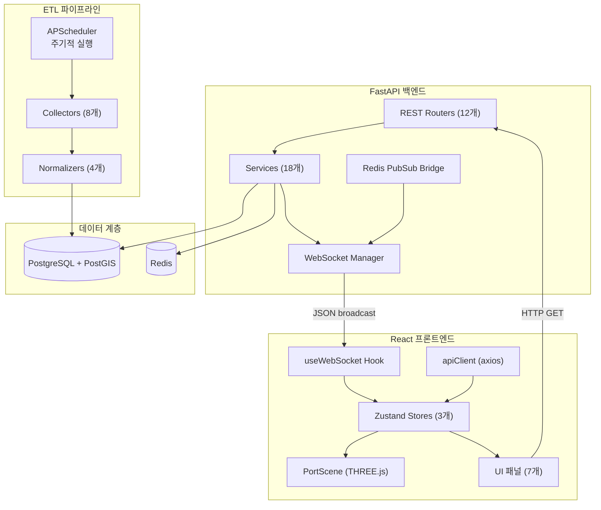

### 14.2 Static / Demo 모드 (GitHub Pages)

백엔드 없이 브라우저에서 동작하는 데모 모드이다.

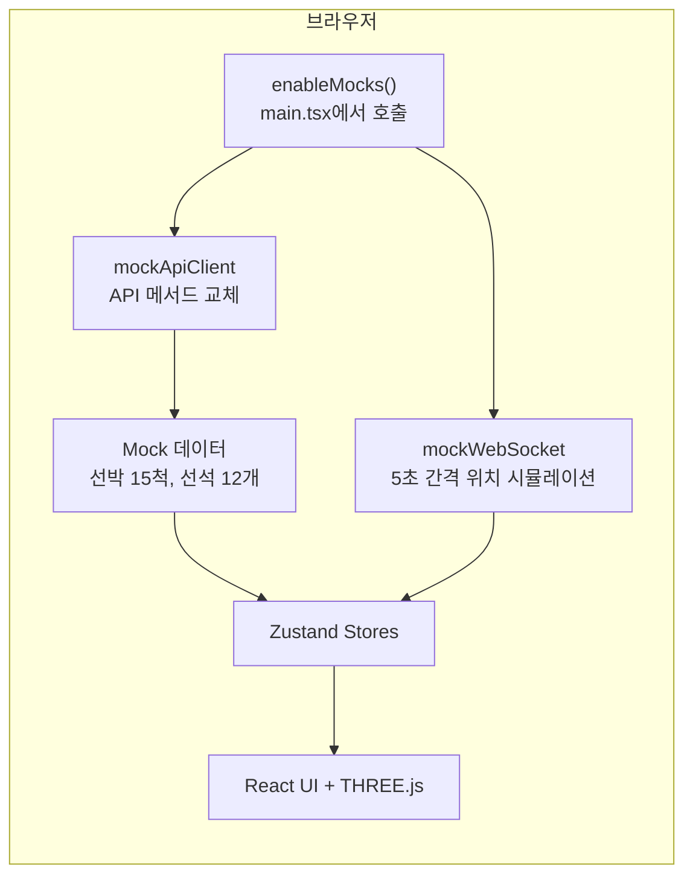

두 모드의 코드 공유

프론트엔드 컴포넌트는 `apiClient` 객체를 통해 데이터에 접근한다. Full-Stack 모드에서는 `api/client.ts`의 axios HTTP 클라이언트를, Static 모드에서는 `mock/mockClient.ts`의 인메모리 데이터를 사용한다. `enableMocks()`가 `Object.assign`으로 메서드를 교체하므로 컴포넌트 코드 변경이 불필요하다.

---

## 15. 데이터 흐름 상세

### 15.1 선박 위치 데이터 수명주기

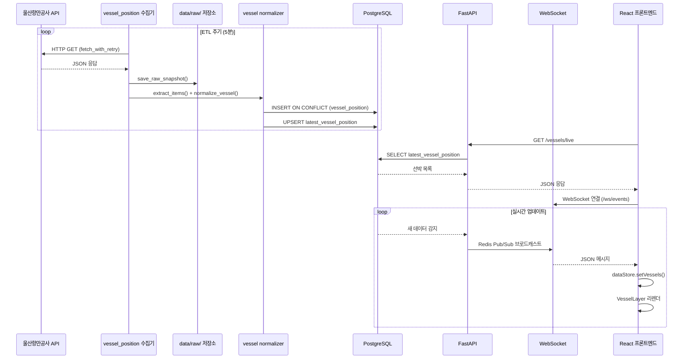

### 15.2 알림 생성 흐름

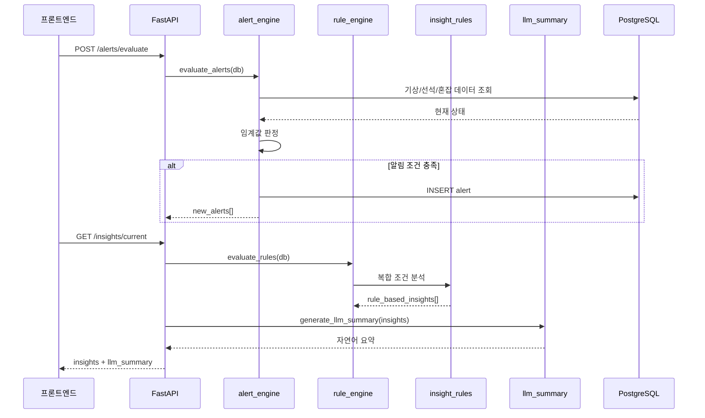

---

## 16. 모듈 의존성

### 16.1 백엔드 모듈 관계

```mermaid
graph TD
    MAIN["main.py"] --> CORE_CFG["core/config.py"]
    MAIN --> CORE_DB["core/database.py"]
    MAIN --> CORE_ERR["core/errors.py"]
    MAIN --> SEED["services/seed.py"]

    MAIN --> R_VESSEL["routers/vessels"]
    MAIN --> R_BERTH["routers/berths"]
    MAIN --> R_WEATHER["routers/weather"]
    MAIN --> R_STATS["routers/stats"]
    MAIN --> R_GRAPH["routers/graph"]
    MAIN --> R_SCEN["routers/scenarios"]
    MAIN --> R_INSIGHT["routers/insights"]
    MAIN --> R_WS["routers/websocket"]
    MAIN --> R_PORT["routers/port"]
    MAIN --> R_DOCS["routers/docs"]
    MAIN --> R_HEALTH["routers/health"]

    R_VESSEL --> S_VESSEL["services/vessels"]
    R_BERTH --> S_BERTH["services/berths"]
    R_WEATHER --> S_WEATHER["services/weather"]
    R_STATS --> S_STATS["services/stats"]
    R_GRAPH --> S_GRAPH["services/graph"]
    R_SCEN --> S_SCEN["services/scenarios"]
    R_PORT --> S_PORT["services/port"]
    R_DOCS --> S_DOCS["services/docs"]
    R_WS --> S_PUBSUB["services/pubsub"]

    R_INSIGHT --> S_ALERT["services/alert_engine"]
    R_INSIGHT --> S_RULE["services/rule_engine"]
    R_INSIGHT --> S_LLM["services/llm_summary"]
    S_RULE --> S_INSIGHT_R["services/insight_rules"]

    S_VESSEL --> M_TS["models/timeseries"]
    S_BERTH --> M_ST["models/static"]
    S_WEATHER --> M_TS
    S_GRAPH --> M_ST
    S_GRAPH --> M_TS
    S_DOCS --> M_DOC["models/documents"]

    CORE_DB --> M_BASE["models/base"]
    M_ST --> M_BASE
    M_TS --> M_BASE
    M_DOC --> M_BASE

    S_PUBSUB --> REDIS[("Redis")]

    style MAIN fill:#f96,stroke:#333
    style S_GRAPH fill:#9f6,stroke:#333
    style M_BASE fill:#69f,stroke:#333
    style S_PUBSUB fill:#ff9,stroke:#333
```

### 16.2 프론트엔드 모듈 관계

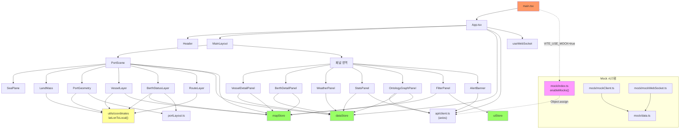

---

## 17. 상태 관리 아키텍처

Zustand 3개 스토어의 상세 데이터 흐름을 보여준다.

### 17.1 스토어 상세 구조

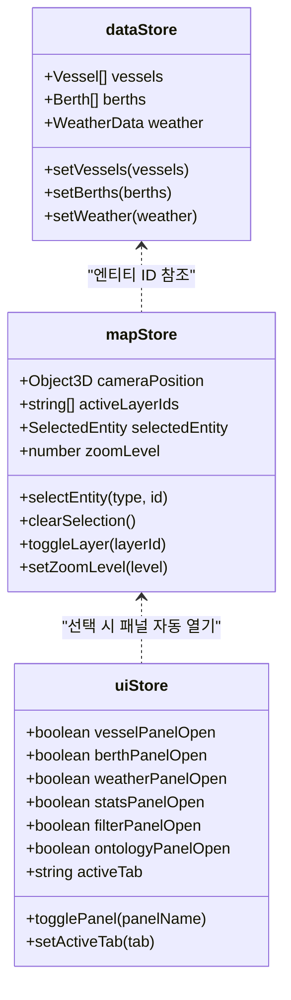

### 17.2 데이터 → UI 렌더링 흐름

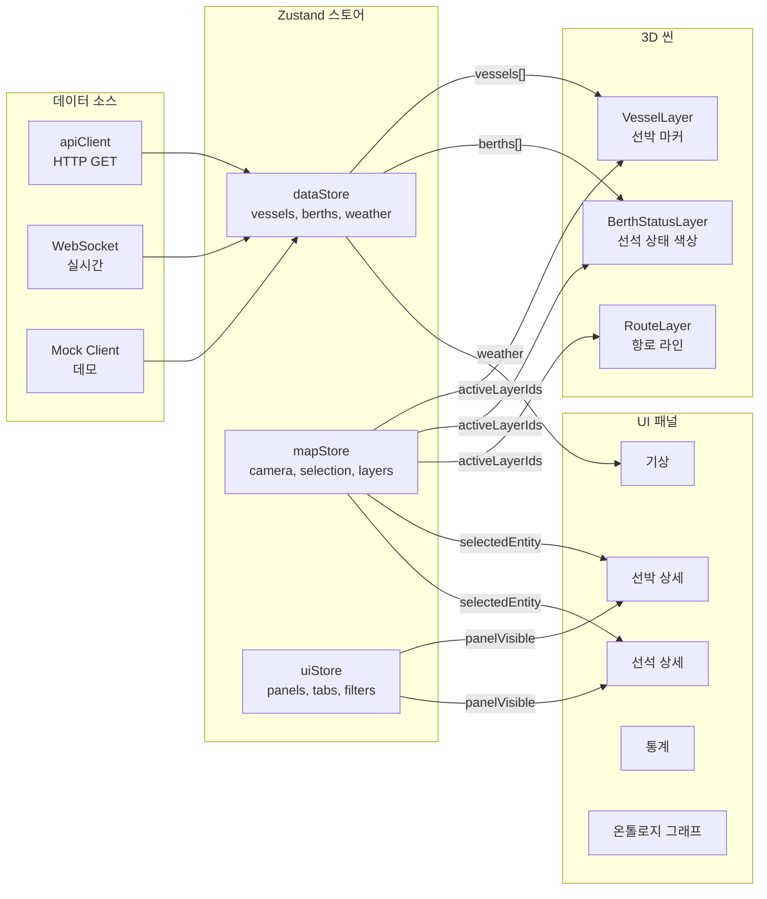

---

## 18. 이벤트 구동 아키텍처

시스템은 WebSocket + Redis Pub/Sub 기반의 이벤트 구동 패턴을 사용한다.

### 18.1 이벤트 유형

| 이벤트 | 발생 시점 | 전달 채널 | 소비자 |
|--------|-----------|-----------|--------|
| `sensor_update` | ETL 수집 완료 시 | Redis → WebSocket | 선박/선석/기상 레이어 |
| `vessel_position` | 선박 위치 갱신 시 | Redis → WebSocket | VesselLayer, VesselDetailPanel |
| `berth_status_change` | 선석 상태 전환 시 | Redis → WebSocket | BerthStatusLayer, AlertBanner |
| `weather_alert` | 기상 임계값 초과 시 | REST + WebSocket | WeatherPanel, AlertBanner |
| `congestion_alert` | 혼잡 임계값 초과 시 | REST | AlertBanner |

### 18.2 WebSocket 메시지 흐름

```mermaid
sequenceDiagram
    participant ETL as ETL 수집기
    participant DB as PostgreSQL
    participant REDIS as Redis
    participant API as FastAPI
    participant WS as WebSocket Router
    participant FE as 프론트엔드

    ETL->>DB: 새 데이터 적재
    API->>REDIS: PUBLISH (채널, 이벤트)
    
    Note over WS: RedisPubSubService 구독 중
    REDIS-->>WS: 메시지 수신
    WS-->>FE: JSON broadcast

    FE->>FE: useWebSocket onMessage
    FE->>FE: dataStore.setVessels() 등
    FE->>FE: React 리렌더 트리거
```

### 18.3 이벤트 생성 조건

```mermaid
stateDiagram-v2
    [*] --> 데이터수신: ETL 수집 완료

    state 기상판정 {
        [*] --> 풍속체크: wind_speed 확인
        풍속체크 --> 경고: > 임계값
        풍속체크 --> 정상
        [*] --> 파고체크: wave_height 확인
        파고체크 --> 경고: > 임계값
        파고체크 --> 정상
        [*] --> 시정체크: visibility 확인
        시정체크 --> 경고: < 임계값
        시정체크 --> 정상
    }

    state 선석판정 {
        [*] --> 점유확인: 구역별 선석 상태
        점유확인 --> 비가용: 전체 점유
        점유확인 --> 가용: 여유 있음
    }

    state 혼잡판정 {
        [*] --> 대기확인: 대기 선박 수
        대기확인 --> 혼잡: > 임계값
        대기확인 --> 원활
    }

    데이터수신 --> 기상판정
    데이터수신 --> 선석판정
    데이터수신 --> 혼잡판정

    경고 --> 단일알림: 1개 조건
    비가용 --> 단일알림
    혼잡 --> 단일알림
    경고 --> 복합알림: 2개+ 동시
    비가용 --> 복합알림
    혼잡 --> 복합알림

    단일알림 --> [*]
    복합알림 --> [*]
```

---

## 19. 확장 포인트

| 확장 영역 | 현재 구현 | 확장 방법 |
|-----------|----------|-----------|
| **데이터 소스** | 울산항만공사 공공 API (Mock) | 실제 API 키 연동, 추가 공공데이터 소스 |
| **3D 렌더링** | 프로시저럴 THREE.js 메쉬 | Spark 2.0 포토리얼리스틱, 실제 선박 3D 모델 |
| **데이터베이스** | PostgreSQL + PostGIS | 읽기 전용 복제본, 커넥션 풀 최적화 |
| **실시간** | Redis Pub/Sub + WebSocket | Redis Streams, 메시지 영속화 |
| **AI/ML** | 규칙 엔진 + LLM 요약 | 혼잡 예측 모델, 최적 입항 스케줄링 |
| **인증** | 없음 (공개 데모) | FastAPI OAuth2 + JWT |
| **알림** | UI 배너 전용 | Webhook → SMS/Email/Push 알림 |
| **모바일** | 데스크톱 전용 | 반응형 UI + 터치 제스처 3D 컨트롤 |
| **다국어** | 한국어 (데이터) + 영어 (코드) | i18n 프레임워크 → UI 다국어 전환 |
| **타 항만** | 울산항 전용 | 온톨로지 기반 설계로 부산항/인천항 확장 가능 |

---

## 20. 향후 발전 방향

| 영역 | 계획 |
|------|------|
| **실시간 연동** | 울산항만공사 실제 API 키 연동 → Mock에서 실데이터 전환 |
| **AI 고도화** | LLM 기반 상황 요약 → 혼잡 예측 모델 + 최적 입항 스케줄링 |
| **3D 고도화** | Spark 2.0 포토리얼리스틱 배경, LOD 최적화, 선박 3D 모델 교체 |
| **모바일 대응** | 반응형 UI + 터치 제스처 3D 컨트롤 |
| **다국어** | 한국어/영어 UI 전환 |
