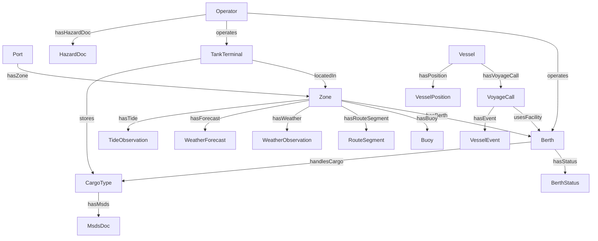

# Ontology Reference

## Purpose

This document describes the ontology used by the Ulsan Port 3D Monitoring System and aligns the conceptual product vocabulary with the canonical classes and relations implemented in `packages/ontology/src/index.ts`.

The ontology is shared infrastructure. Backend graph APIs, ETL data modeling, and frontend graph exploration should all use the same class names and relationship semantics.

## Source of Truth

Canonical definitions live in:

- `packages/ontology/src/index.ts`

This document preserves those exact ontology class groups and relationship statements while also mapping them to business-oriented terms used in product and operations discussions.

## Conceptual Entity Mapping

The product vocabulary often uses broader business terms. The implementation currently maps them as follows:

| Business term | Canonical implementation |
|---|---|
| Port | `Port` |
| PortZone | `Zone` |
| Berth | `Berth` |
| Vessel | `Vessel` |
| VoyageCall | `VoyageCall` |
| Operator | `Operator` |
| Terminal | `Terminal` |
| TankTerminal | `TankTerminal` |
| Buoy | `Buoy` |
| RouteSegment | `RouteSegment` |
| CargoType | `CargoType` |
| WeatherStation | `WeatherObservation` / `WeatherForecast` producer context |
| TideStation | `TideObservation` producer context |
| Document | `HazardDoc`, `MsdsDoc`, `SafetyManual` |

## Canonical Ontology Classes

### Spatial

#### Port

Top-level container representing Ulsan Port as a monitored operational domain.

#### Zone

Operational subdivision of the port. In product terminology this is the `PortZone` concept.

#### Berth

Docking or handling facility where vessels are assigned or monitored.

#### Buoy

Navigational or monitoring point associated with a zone.

#### RouteSegment

Route geometry or navigational segment used to describe port movement corridors.

#### Terminal

General terminal entity for future expansion and shared facility grouping.

#### TankTerminal

Specialized storage and cargo-handling terminal, typically associated with liquid cargo operations.

#### Operator

Organization responsible for operating berths or tank terminals.

### Operational

#### Vessel

Ship or watercraft entity tracked by the monitoring system.

#### VoyageCall

Operational call instance connecting a vessel to facility usage and event history.

#### VesselPosition

Observed vessel position snapshot used for live monitoring and playback.

#### VesselEvent

Operational event associated with a voyage or vessel, such as arrival, departure, berthing, or unberthing.

#### BerthStatus

Latest or historical operational condition for a berth.

#### CongestionStat

Aggregated congestion metric describing waiting counts or delay pressure.

### Cargo

#### CargoType

Cargo classification used for berth handling, storage, and document association.

#### LiquidCargoStat

Aggregated liquid cargo metric associated with time and operational scope.

#### ArrivalStat

Aggregated arrival metric by period and location.

### Environmental

#### WeatherObservation

Observed weather state for a zone; corresponds conceptually to current station output.

#### WeatherForecast

Forecast weather series associated with a zone.

#### TideObservation

Observed tide information for operational use; conceptually tied to tide-station output.

#### HazardDoc

Hazard-related operational document associated with an operator.

#### MsdsDoc

MSDS document associated with a cargo type.

#### SafetyManual

Safety guidance document class reserved for documentation and future operational use.

### UI / Application

#### Alert

Application-layer operational alert generated from rule evaluation.

#### Insight

Rule-based or summary-level insight representing the interpreted current state.

#### ScenarioFrame

Historical or simulated snapshot frame used for scenario playback.

## Canonical Relationship Statements

The following relations match `ONTOLOGY_RELATIONS` exactly.

| Subject | Predicate | Object | Meaning |
|---|---|---|---|
| Port | hasZone | Zone | A port contains one or more zones. |
| Zone | hasBerth | Berth | A zone contains berths. |
| Zone | hasBuoy | Buoy | A zone contains navigational buoys. |
| Zone | hasRouteSegment | RouteSegment | A zone contains route segments. |
| Operator | operates | Berth | An operator manages a berth. |
| Operator | operates | TankTerminal | An operator manages a tank terminal. |
| TankTerminal | locatedIn | Zone | A tank terminal belongs to a zone. |
| TankTerminal | stores | CargoType | A tank terminal stores cargo types. |
| Vessel | hasVoyageCall | VoyageCall | A vessel has one or more voyage calls. |
| VoyageCall | usesFacility | Berth | A voyage call uses a berth facility. |
| VoyageCall | hasEvent | VesselEvent | A voyage call has vessel events. |
| Vessel | hasPosition | VesselPosition | A vessel has tracked positions. |
| Berth | hasStatus | BerthStatus | A berth has status records. |
| Berth | handlesCargo | CargoType | A berth handles cargo types. |
| Zone | hasWeather | WeatherObservation | A zone has weather observations. |
| Zone | hasForecast | WeatherForecast | A zone has weather forecasts. |
| Zone | hasTide | TideObservation | A zone has tide observations. |
| Operator | hasHazardDoc | HazardDoc | An operator has hazard documents. |
| CargoType | hasMsds | MsdsDoc | A cargo type has MSDS documents. |

## Relationship Usage Notes

- `operates` is intentionally reused for berth and tank terminal ownership/management.
- `locatedIn` is currently modeled for `TankTerminal -> Zone` and may later be extended to additional facility types.
- `hasWeather`, `hasForecast`, and `hasTide` attach environmental context to zones rather than directly to vessels or berths.
- `hasHazardDoc` and `hasMsds` keep document discovery aligned with operational and cargo entities.

## Mermaid Graph

## Design Constraints

- Add new entity classes to `packages/ontology` before backend schema or API changes.
- Preserve exact predicate names across ETL, backend, and frontend graph features.
- Keep business-language aliases documented when implementation names differ, especially `PortZone -> Zone`.
- Treat `Alert`, `Insight`, and `ScenarioFrame` as application-layer ontology classes rather than physical maritime assets.

## Recommended Extension Areas

Future ontology expansion may include:

- explicit weather station and tide station entities
- terminal-to-berth relationships
- document supersession/version links
- cargo movement and transfer events
- berth maintenance and closure windows

Until those are added, downstream code should rely only on the canonical classes and relations currently exported by the package.
