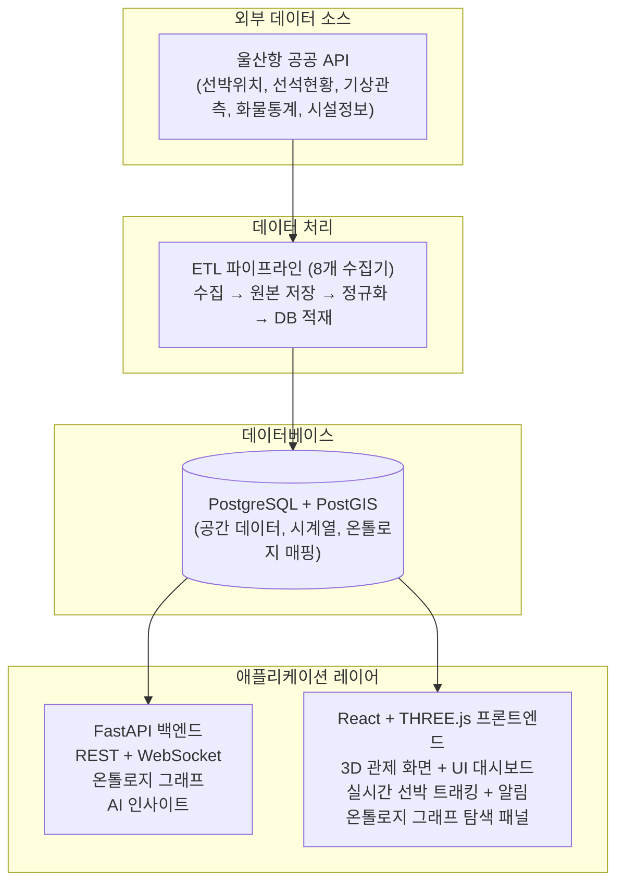
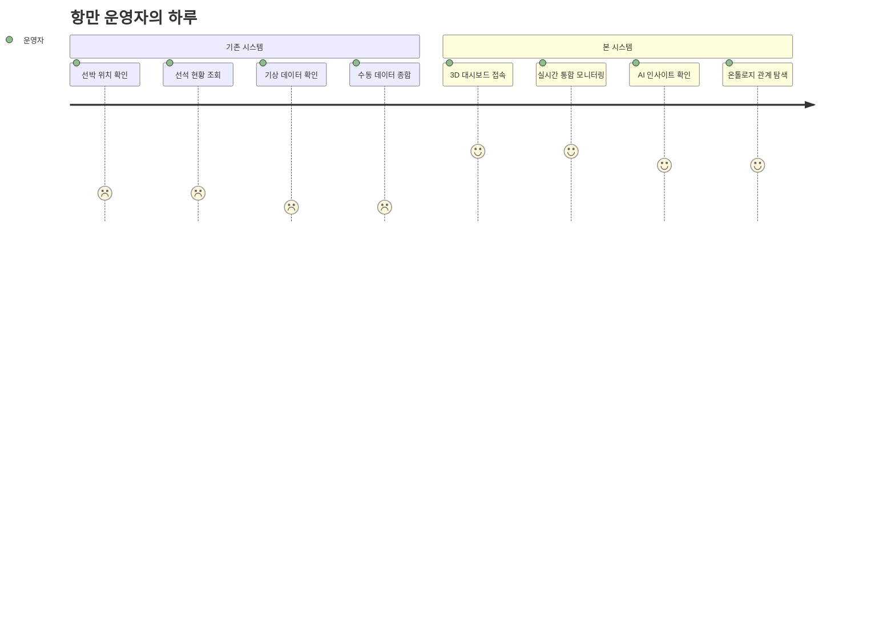
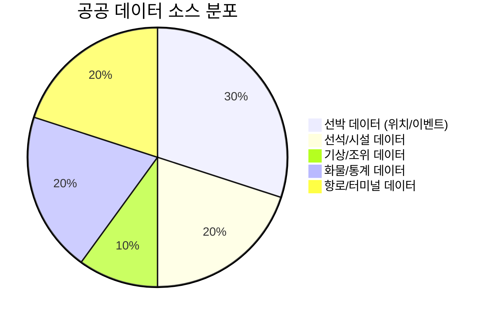
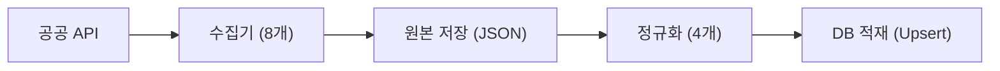
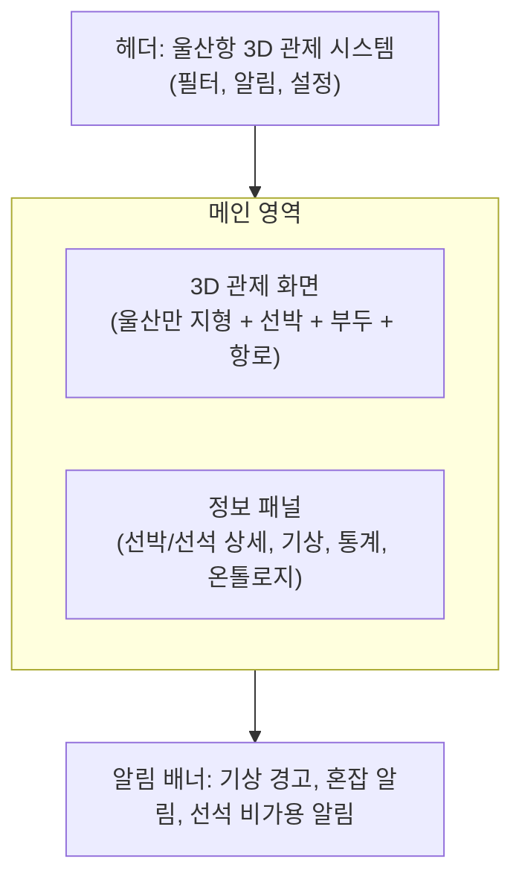
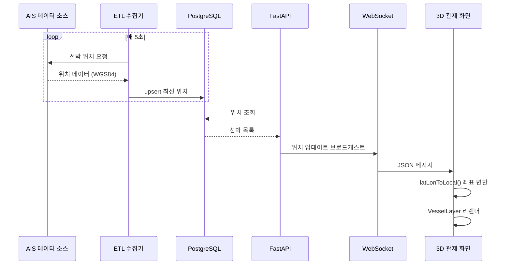
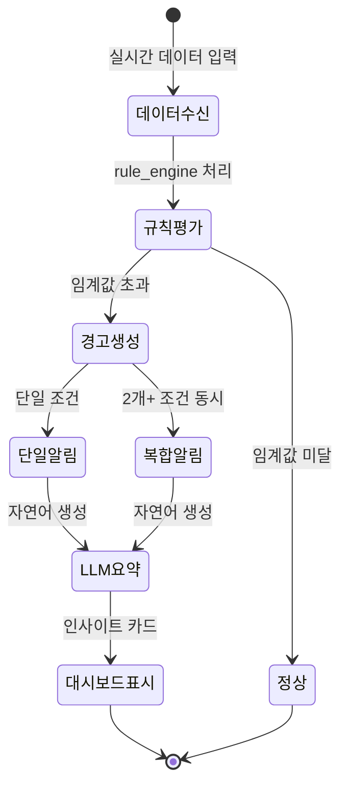
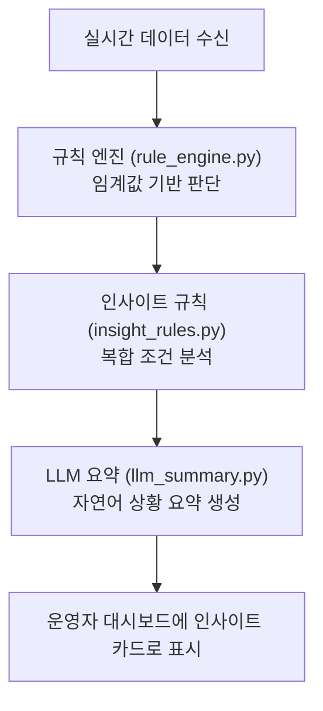
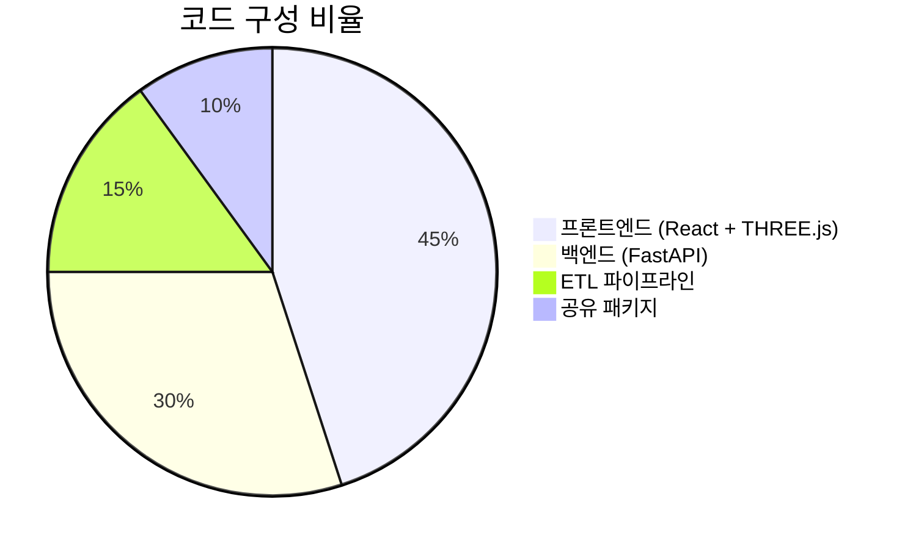
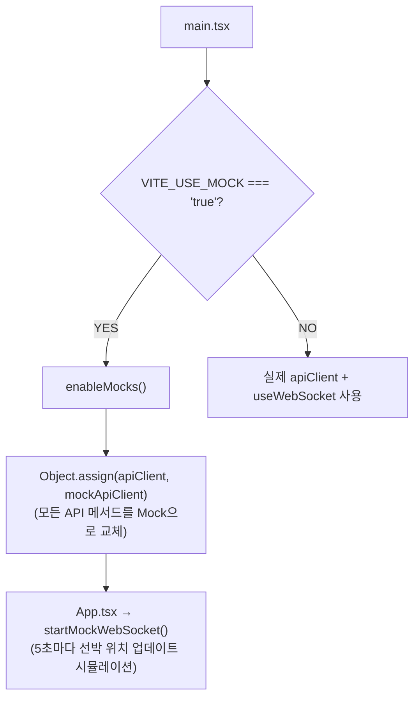

# 울산항 3D 관제 시스템 — 프로젝트 소개서

> **2026 스마트해운물류 × ICT 멘토링** 공모전 제출용
>
> 프로젝트: `ulsan-port-3d` | 팀: [팀명 기입] | 작성일: 2026-04-24

---

## 1. 프로젝트 동기

### 1.1 해결하고자 하는 문제

울산항은 연간 4만 척 이상의 선박이 입출항하는 국내 최대 액체화물 항만이다.
그러나 항만 운영에 필요한 데이터(선박 위치, 선석 현황, 기상, 화물 통계 등)는 다음과 같이 **분절**되어 있다:

| 문제점 | 현황 |
|--------|------|
| **데이터 분산** | 울산항만공사 API, 기상청 API, 해양수산부 포털 등 각기 다른 소스에서 제공 |
| **시각화 부재** | 대부분 2D 테이블 형태의 정적 웹페이지로 제공되어 공간적 맥락 파악 불가 |
| **통합 관제 미비** | 선박·선석·기상·화물을 한눈에 볼 수 있는 통합 대시보드 부재 |
| **의미적 연결 부재** | 선박↔항차↔선석↔운영사↔화물 간 관계를 탐색할 수 없음 |
| **실시간성 부족** | 배치 업데이트 위주로, 실시간 상황 변화 대응 어려움 |

### 1.2 프로젝트 비전

> **울산항 공공데이터를 온톨로지 기반 지식 그래프로 통합하고,
> 3D WebGL 관제 화면으로 실시간 시각화하여
> 항만 운영자의 의사결정을 지원하는 풀스택 시스템**

---

## 2. 솔루션 개요

### 2.1 시스템 구성



### 2.2 핵심 기능

| # | 기능 | 설명 |
|---|------|------|
| 1 | **3D 실시간 관제** | 울산만 실제 지형(해안선, 방파제, 태화강) 위에 선박·부두를 3D 렌더링. 선박은 종류별(컨테이너, 탱커, 화물, 여객, 예인) 프로시저럴 모델로 구현 |
| 2 | **선박 트래킹** | AIS 데이터 기반 실시간 위치·방향·속도 업데이트. 15척 이상 동시 모니터링, 선박 클릭 시 상세 정보 패널 |
| 3 | **선석 상태 모니터링** | 12개 부두(일반, 벌크, 석유, 컨테이너, 여객)의 가동 상태를 색상 코드로 시각화 |
| 4 | **기상 통합** | 풍속, 파고, 시정 등 기상 관측 데이터를 3D 씬 위에 오버레이. 기상 악화 시 자동 알림 |
| 5 | **온톨로지 그래프 탐색** | 25개 클래스, 20개 관계를 포함한 항만 지식 그래프. 선박→항차→선석→운영사→화물 등 관계 탐색 |
| 6 | **AI 인사이트** | 혼잡도·기상·화물 데이터 결합 → 규칙 엔진 + LLM 기반 상황 요약 → 운영 의사결정 지원 |
| 7 | **시나리오 재생** | 과거 상황 프레임을 저장하고 타임라인으로 재생. 사고 분석 및 교육용 |
| 8 | **통계 대시보드** | 월간 입항 통계, 액체화물 통계, 혼잡 통계 (대기 선박 수, 평균 대기 시간) |

### 2.3 데모

> **GitHub Pages 라이브 데모**: [https://yeongseon.github.io/ulsan-port-3d/](https://yeongseon.github.io/ulsan-port-3d/)
>
> Mock 데이터(선박 15척, 선석 12개)로 백엔드 없이 전체 UI를 체험할 수 있습니다.

---

## 3. 차별점

### 3.1 기존 솔루션 대비 차별화

| 비교 항목 | 기존 항만 모니터링 | 본 프로젝트 |
|-----------|-------------------|-------------|
| **시각화** | 2D 지도 + 테이블 | 3D WebGL 실감 관제 (실제 지형 렌더링) |
| **데이터 모델** | 관계형 DB 직접 쿼리 | 온톨로지 기반 지식 그래프 (25 클래스, 20 관계) |
| **관계 탐색** | SQL JOIN 기반 단순 조회 | 그래프 기반 다방향 탐색 (선박↔항차↔선석↔운영사↔화물) |
| **실시간성** | 배치 갱신 (분~시 단위) | WebSocket + Redis Pub/Sub (초 단위) |
| **인사이트** | 수동 판단 | AI 규칙 엔진 + LLM 요약으로 자동 생성 |
| **확장성** | 모놀리식 | 모노레포 + 공유 패키지 + 온톨로지 우선 설계 |

### 사용자 여정 비교


### 3.2 기술적 혁신

1. **온톨로지 우선 설계 (Ontology-First Architecture)**
   - 모든 도메인 엔티티를 `packages/ontology`에서 OWL 스타일로 먼저 정의
   - DB 스키마, API 응답, 프론트엔드 타입이 온톨로지를 단일 소스(Single Source of Truth)로 참조
   - 새로운 도메인 확장 시 온톨로지만 수정하면 전 레이어에 자동 전파

2. **3D 레이어 분리 아키텍처**
   - 정적 씬(해안선, 부두, 크레인)과 동적 오버레이(선박 위치, 선석 상태)를 엄격히 분리
   - React.memo + Zustand 셀렉터로 불필요한 리렌더 방지
   - 1,000척 이상 선박 동시 렌더링 가능한 확장 설계

3. **프로시저럴 선박 모델 시스템**
   - 5종 선박(컨테이너, 탱커, 화물, 여객, 예인)을 코드로 생성
   - 선체, 갑판, 브릿지, 마스트, 선종별 디테일을 조합
   - 외부 3D 에셋 의존 없이 즉시 렌더링 가능

4. **실제 지형 기반 3D 해안선**
   - 울산만의 실제 WGS84 좌표를 기반으로 해안선, 방파제, 태화강을 ExtrudeGeometry로 렌더링
   - 서쪽 본토(부두 배후지), 북쪽 곶(미포항 방면), 남쪽 반도(장생포), 항만 산업구역까지 재현

---

## 4. 기술 스택

### 4.1 전체 기술 스택

| 계층 | 기술 | 선정 이유 |
|------|------|-----------|
| **프론트엔드** | React 19 + TypeScript 5 | 타입 안전한 컴포넌트 개발, 대규모 생태계 |
| **3D 렌더링** | THREE.js + @react-three/fiber | 웹 기반 3D 렌더링 업계 표준, React 통합 |
| **상태 관리** | Zustand 5 | 경량, 보일러플레이트 최소, 셀렉터 기반 리렌더 최적화 |
| **스타일링** | Tailwind CSS 4 | 유틸리티 CSS, 빠른 UI 개발 |
| **번들러** | Vite 6 | 빠른 HMR, ESM 기반 |
| **백엔드** | FastAPI | 비동기 Python 웹 프레임워크, 자동 OpenAPI 생성 |
| **ORM** | SQLAlchemy 2.0 (async) | 타입 안전 비동기 ORM, PostGIS 지원 |
| **데이터베이스** | PostgreSQL + PostGIS | 공간 쿼리 지원, 산업 표준 RDBMS |
| **메시지 브로커** | Redis Pub/Sub | 경량 실시간 이벤트 전파 |
| **ETL** | Python + httpx + APScheduler | 비동기 HTTP, 주기적 스케줄링 |
| **온톨로지** | TypeScript (자체 정의) | packages/ontology에서 클래스·관계를 코드로 관리 |
| **CI/CD** | GitHub Actions | 빌드·린트·테스트 자동화, GitHub Pages 배포 |
| **컨테이너** | Docker Compose | 로컬 개발 환경 일원화 |

### 4.2 모노레포 구조

```
ulsan-port-3d/
├── apps/frontend/       # React + THREE.js (3D 관제 화면)
├── apps/backend/        # FastAPI (REST + WebSocket + 그래프 API)
├── etl/                 # ETL 파이프라인 (8개 수집기 + 4개 정규화)
├── packages/ontology/   # 온톨로지 정의 (Single Source of Truth)
├── packages/shared-types/ # 프론트-백엔드 공유 타입
├── packages/ui/         # 공통 UI 컴포넌트
├── docs/                # 프로젝트 문서
└── .github/workflows/   # CI/CD 파이프라인
```

**프로젝트 규모**: 115개 소스 파일, 약 9,500줄의 코드

---

## 5. 데이터 활용

### 5.1 공공 데이터 소스

본 프로젝트는 다음 울산항 공공데이터를 활용한다:

| 데이터 소스 | 제공 기관 | 활용 내용 |
|-------------|----------|-----------|
| 선박 위치 (AIS) | 울산항만공사 | 실시간 선박 위치·방향·속도 트래킹 |
| 선석 현황 | 울산항만공사 | 12개 부두의 가동 상태 모니터링 |
| 선석 시설 정보 | 울산항만공사 | 부두 마스터 데이터 (크기, 수심, 장비) |
| 선박 입출항 이벤트 | 울산항만공사 | 선박 항차(Voyage) 이력 추적 |
| 기상 관측 | 기상청 / 항만 기상 | 풍속, 파고, 시정, 기온 등 |
| 입항 통계 | 울산항만공사 | 월간 선박 입항 실적 |
| 화물 통계 | 울산항만공사 | 월간 액체화물 처리 실적 |
| 항로 GIS | 울산항만공사 | 항로 라인 좌표 데이터 |
| 유류 터미널 | 울산항만공사 | 탱크 터미널 시설 현황 |

### 공공 데이터 소스 분포


### 5.2 데이터 파이프라인



- **수집**: httpx 비동기 HTTP + 3회 재시도 + 지수 백오프
- **원본 저장**: `data/raw/{source}/{date}/{timestamp}.json` (변조 방지)
- **정규화**: WGS84 좌표 통일, UTC 시간 변환, 식별자 표준화
- **적재**: INSERT ON CONFLICT (upsert)로 히스토리 + 최신 스냅샷 동시 관리

### 5.3 데이터 품질 관리

| 규칙 | 설명 |
|------|------|
| **좌표 표준** | 모든 지리 데이터는 WGS84 (EPSG:4326)로 저장 |
| **시간 표준** | 모든 타임스탬프는 UTC 저장, 프론트엔드에서 Asia/Seoul 변환 표시 |
| **원본 보존** | 정규화 전 원본 API 응답을 반드시 저장 (추적 가능성 확보) |
| **실/가상 분리** | 시뮬레이션 데이터는 `is_simulated: true`로 명시 라벨링, 혼합 금지 |

---

## 6. 온톨로지 설계

### 6.1 개요

기존 항만 시스템이 단순 관계형 모델로 데이터를 저장하는 것과 달리,
본 프로젝트는 **온톨로지 기반 지식 그래프**로 항만 도메인을 모델링한다.

이를 통해:
- 선박과 관련된 모든 정보(항차, 선석, 운영사, 화물)를 **그래프로 탐색** 가능
- 새로운 엔티티·관계 추가 시 **온톨로지만 수정하면 전 레이어 자동 반영**
- 항만 도메인 전문가와 개발자 간 **공통 어휘(Vocabulary)** 확보

### 6.2 클래스 구조 (25개)

| 도메인 | 클래스 | 설명 |
|--------|--------|------|
| **공간** | Port, Zone, Berth, Buoy, RouteSegment, Terminal, TankTerminal, Operator | 항만 물리 인프라 |
| **운항** | Vessel, VoyageCall, VesselPosition, VesselEvent, BerthStatus, CongestionStat | 선박 운항 및 선석 상태 |
| **화물** | CargoType, LiquidCargoStat, ArrivalStat | 화물 분류 및 통계 |
| **환경** | WeatherObservation, WeatherForecast, TideObservation, HazardDoc, MsdsDoc, SafetyManual | 기상 및 안전 문서 |
| **시스템** | Alert, Insight, ScenarioFrame | 시스템 생성 객체 |

### 6.3 관계 구조 (20개)

```
Port ──hasZone──▶ Zone ──hasBerth──▶ Berth ──hasStatus──▶ BerthStatus
                       ──hasBuoy──▶ Buoy
                       ──hasWeather──▶ WeatherObservation

Vessel ──hasVoyageCall──▶ VoyageCall ──usesFacility──▶ Berth
       ──hasPosition──▶ VesselPosition

Operator ──operates──▶ Berth / TankTerminal
         ──hasHazardDoc──▶ HazardDoc

TankTerminal ──stores──▶ CargoType ──hasMsds──▶ MsdsDoc
```

### 6.4 그래프 탐색 API

`/graph/{entity_type}/{entity_id}` 엔드포인트를 통해 임의 엔티티에서 출발하여
온톨로지 관계를 따라 연결된 엔티티들을 그래프 형태로 탐색할 수 있다.

프론트엔드의 **온톨로지 그래프 패널**에서 노드를 클릭하면 관련 엔티티로 확장 탐색이 가능하다.

---

## 7. 3D 관제 화면

### 7.1 화면 구성



### 7.2 3D 씬 구성

| 레이어 | 내용 | 갱신 방식 |
|--------|------|-----------|
| **StaticScene** | 해수면, 울산만 해안선·방파제·태화강, 부두·크레인·저유탱크 | 1회 렌더 (React.memo) |
| **DynamicLayers** | 선박 위치·방향, 선석 상태 색상, 항로 라인 | 실시간 (WebSocket/HTTP) |

### 실시간 선박 트래킹 흐름


### 7.3 울산만 실제 지형 재현

실제 WGS84 좌표를 기반으로 다음 지형 요소를 3D로 재현:

- **서쪽 본토**: 모든 부두의 배후지 (산업단지)
- **북쪽 곶**: 미포항 방면, 울산만 입구 북측
- **남쪽 반도**: 장생포, 울산만 입구 남측
- **북방파제 / 남방파제**: 울산만 입구 보호 구조물
- **태화강**: 본토를 가로지르는 하천
- **항만 산업구역**: 부두와 해안선 사이 매립지

### 7.4 선박 렌더링

5종 선박을 프로시저럴(절차적) 메쉬로 생성:

| 선종 | 특징적 구조물 |
|------|-------------|
| 컨테이너선 | 컨테이너 적재 스택 |
| 탱커 | 원형 탱크 돔 |
| 화물선 | 화물창 덮개 |
| 여객선 | 객실 블록 + 창문 |
| 예인선 | 소형 선체 |

---

## 8. AI 및 지능형 분석

### 8.1 복합 알림 엔진

다중 데이터 소스(기상, 선석, 혼잡도)를 실시간으로 분석하여 복합 알림을 생성한다:

| 알림 유형 | 트리거 조건 | 심각도 |
|-----------|------------|--------|
| 기상 경보 | 풍속 > 임계값, 파고 > 임계값, 시정 < 임계값 | Critical / Warning |
| 선석 비가용 | 특정 구역 선석 전체 점유 | Warning |
| 혼잡 | 대기 선박 수 > 임계값, 평균 대기 시간 > 임계값 | Warning / Info |
| 복합 | 위 조건 2개 이상 동시 발생 | Critical |

### 알림 수명 주기


### 8.2 규칙 엔진 + LLM 요약



### 8.3 시나리오 재생

- 과거 특정 시점의 선박 위치, 선석 상태, 기상, 알림을 **프레임 단위로 저장**
- 타임라인 UI로 **시간 순서대로 재생** 가능
- 사고 분석, 운영 패턴 교육, 의사결정 복기에 활용

---

## 9. 프로젝트 구조 및 규모

### 9.1 정량 지표

| 항목 | 수치 |
|------|------|
| 소스 파일 수 | 115개 |
| 총 코드 라인 | ~9,500줄 |
| 백엔드 라우터 | 12개 |
| 백엔드 서비스 | 18개 |
| ETL 수집기 | 8개 |
| ETL 정규화 모듈 | 4개 |
| 3D 씬 컴포넌트 | 7개 |
| UI 패널 | 7개 |
| Zustand 스토어 | 3개 |
| 온톨로지 클래스 | 25개 |
| 온톨로지 관계 | 20개 |
| API 엔드포인트 | 24개 (HTTP 22 + WebSocket 2) |
| Mock 데이터 | 선박 15척, 선석 12개 |

### 코드 구성 비율


### 9.2 코드 품질 관리



| 도구 | 역할 |
|------|------|
| TypeScript strict mode | 프론트엔드 타입 안전성 |
| ESLint | 코드 스타일 일관성 |
| Pydantic v2 | 백엔드 요청/응답 스키마 검증 |
| GitHub Actions CI | 빌드·린트·타입체크 자동화 |
| Conventional Commits | 커밋 메시지 표준화 |

---

## 10. 개발 환경 및 실행 방법

### 10.1 사전 준비

- Node.js 20+, pnpm
- Python 3.11+
- Docker / Docker Compose

### 10.2 로컬 실행

```bash
# 전체 스택 실행
docker compose up --build

# 프론트엔드만 (Mock 데이터)
cd apps/frontend
VITE_USE_MOCK=true pnpm dev
```

### 10.3 온라인 데모

> [https://yeongseon.github.io/ulsan-port-3d/](https://yeongseon.github.io/ulsan-port-3d/)

GitHub Pages에서 Mock 데이터 기반으로 전체 UI를 체험할 수 있다.

---

## 11. 향후 발전 계획

| 단계 | 내용 | 기대 효과 |
|------|------|-----------|
| **실데이터 연동** | 울산항만공사 실제 API 키 연동, Mock→실데이터 전환 | 실시간 운영 관제 가능 |
| **AI 고도화** | 혼잡 예측 모델, 최적 입항 스케줄링 알고리즘 | 대기 시간 단축, 운영 효율 향상 |
| **3D 고도화** | 포토리얼리스틱 배경(Spark 2.0), LOD 최적화, 실제 선박 3D 모델 | 몰입감 향상, 대규모 렌더링 최적화 |
| **모바일 대응** | 반응형 UI, 터치 제스처 3D 컨트롤 | 현장 운영자 모바일 접근성 |
| **다국어 지원** | 한국어/영어 UI 전환 | 글로벌 확장 가능성 |
| **타 항만 확장** | 온톨로지 기반 설계 덕분에 부산항, 인천항 등으로 확장 가능 | 범용 항만 관제 플랫폼화 |

---

## 12. 기대 효과

### 12.1 정량적 효과

| 지표 | 기대 개선 |
|------|-----------|
| 데이터 조회 시간 | 여러 시스템 순회 → 단일 대시보드 조회 (70%+ 단축) |
| 상황 파악 속도 | 2D 테이블 해석 → 3D 공간 직관 파악 (50%+ 단축) |
| 알림 대응 시간 | 수동 모니터링 → 자동 복합 알림 (실시간 대응) |
| 관계 탐색 시간 | SQL 조인 기반 쿼리 → 온톨로지 그래프 클릭 탐색 (80%+ 단축) |

### 12.2 정성적 효과

- **통합 상황 인식**: 선박·선석·기상·화물을 하나의 3D 씬에서 맥락과 함께 파악
- **지식 재사용**: 온톨로지로 정의된 항만 도메인 지식이 시스템 전 레이어에서 일관되게 활용
- **확장 용이성**: 온톨로지 우선 설계로 새 엔티티·관계 추가 시 최소한의 코드 변경
- **교육·훈련**: 시나리오 재생 기능으로 신규 운영자 교육 및 사고 사례 학습 가능

---

## 13. 팀 소개

| 역할 | 이름 | 담당 |
|------|------|------|
| [역할] | [이름] | [담당 업무] |
| [역할] | [이름] | [담당 업무] |
| [역할] | [이름] | [담당 업무] |
| [역할] | [이름] | [담당 업무] |

> ※ 팀원 정보를 기입해 주세요.

---

## 14. 참고 자료

| 자료 | 링크 |
|------|------|
| 프로젝트 저장소 | [github.com/yeongseon/ulsan-port-3d](https://github.com/yeongseon/ulsan-port-3d) |
| 라이브 데모 | [yeongseon.github.io/ulsan-port-3d](https://yeongseon.github.io/ulsan-port-3d/) |
| 시스템 아키텍처 문서 | [docs/architecture-ko.md](architecture-ko.md) |
| 제품 요구사항 정의서 | [docs/prd.md](prd.md) |
| 온톨로지 명세서 | [docs/ontology.md](ontology.md) |
| API 스펙 문서 | [docs/api-spec.md](api-spec.md) |
| 공모전 안내 | [2026 스마트해운물류 × ICT 멘토링](https://www.wevity.com/index.php?c=find&s=1&gub=2&cidx=4&gbn=viewok&gp=1&ix=106365) |

---

> 본 문서는 **2026 스마트해운물류 × ICT 멘토링 공모전** 제출용으로 작성되었습니다.
